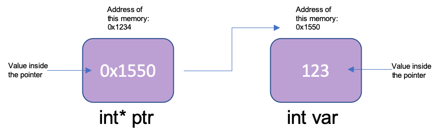

# 1. Pointer
### Addresses
When you declare a variable, the compiler stores it at a memory location.

Given a variable named `var`, we can determine its memory address with `&var`.

```c
#include <stdio.h>

int main() {
    int var = 5;
    printf("value of var : %d\n", var);
    printf("address of var : %p\n", &var);
    return 0;
}
```

If you run the code above, you'll get something like...

```
value of var : 5
address of var : 0x7ffe36dfeab8
```

### What is a Pointer?
**pointer** : A variable for storing addresses of a specific type.  
You use `*` to declare pointer variables.

```c
// all of these are equivalent
int* p0;
int * p1;
int *p2;
```
```c
int num;
int* addr = &num;
/**
 *  The integer pointer variable 'addr' contains 
 *  the address of the integer variable 'num'.
 * /
```

You can access the variable pointed by the pointer (called **dereferencing**). This is done by putting `*` in front of the pointer.


```c
#include <stdio.h>

int num = 10;
int* addr = &num;

int main(void) {
    printf("value of `num` : %d\n", num);
    printf("value of `*addr` : &d\n", *addr);
    return 0;
}
```

#### Sample Code
```c
#include <stdio.h>

int num = 1;
int* addr = &num;

int main(void) {
    printf("&num = %p \n", &num);
    printf("addr = %p \n", addr);
    printf("num = %d \n", num);
    num += 1;
    printf("*addr = %d \n", *addr);
    *addr += 1;
    printf("num = %d \n", num);
    return 0;
}
```

### Pointers As Arguments of Functions
You can pass pointers as arguments of functions just like other variables.
```c
int add(int* a, int* b) {
    return *a + *b;
}
```
because you pass addresses as parameters, you can change the pointed variables within functions.
```c
void swap(int* a, int* b) {
    int temp = *a;
    *a = *b;
    *b = temp;
}
// a becomes b, b becomes a
```
___
## Sources
- https://www.tutorialspoint.com/cprogramming/c_pointers.htm
- https://www.programiz.com/c-programming/c-pointers
